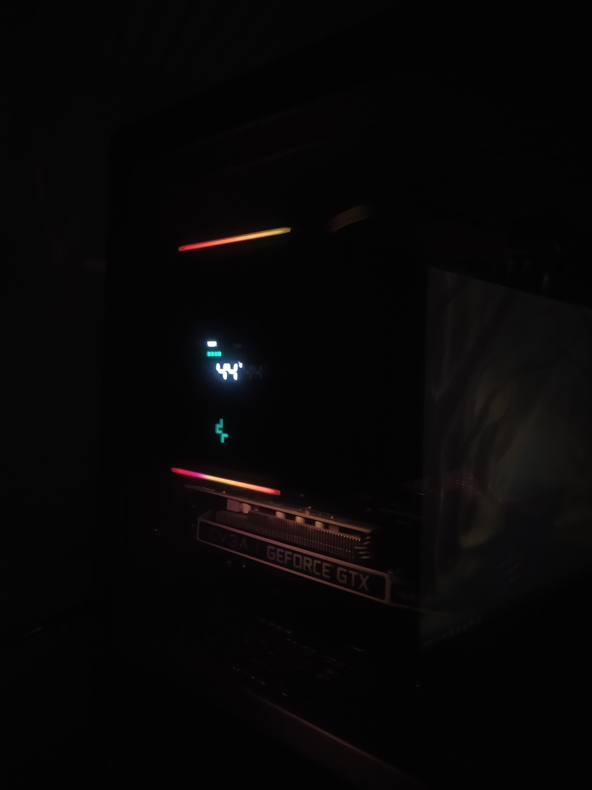

### DeepCool AK Digital for Linux (AKL).

#### About

Unofficial Linux version of DeepCool's AK Digital Software.

Based on <a href="https://github.com/raghulkrishna/deepcool-ak620-digital-linux" target="_blank">raghulkrishnadeepcool-ak620-digital-linux</a>

This project aims to provide the same functionality as DeepCool's Windows version.

> [!NOTE]
> As far as I know, this should work on any Linux distro.

#### Supported CPU Coolers

    DeepCool AK500 Digital
    DeepCool AK620 Digital

#### Requirements

 * libudev
 * libayatana-appindicator
 * libxdo

#### Fedora

`sudo dnf -y install systemd-devel libayatana-appindicator-gtk3-devel libxdo-devel`

> For any other distro, search for the package names and use the native package manager (e.g., apt, pacman, zypper) to install them.

#### Install

1. `git clone https://github.com/z7ealth/akl.git && cd akl`
2. `sudo mkdir /etc/akl && sudo cp config_example.toml /etc/akl/config.toml`

3. Edit /etc/akl/config.toml according to your needs.

4. `sudo cp akl_example.service /etc/systemd/system/akl.service`

5. Edit /etc/systemd/system/akl.service and set the "DISPLAY" and "XAUTHORITY" environment variables. 

6. `sudo systemctl daemon-reload`
7. `cargo build --release`
8. `sudo cp ./target/release/akl /usr/bin/akl`
9. `sudo systemctl enable --now akl.service`

#### Gallery

